# 43_POST_LAUNCH_INTELLIGENCE — Post-Launch Analytics & Optimization

## 1. Why Post-Launch Intelligence Matters
A successful creative project does not end when the site is deployed. The days following a launch are critical: this is when award submissions trigger massive traffic spikes, user interactions are recorded at scale, and edge-case mobile devices expose rendering bugs. 

This system guides teams through post-launch audits at three key milestones: T+24 hours, T+72 hours, and T+30 days.

---

## 2. Post-Launch Timeline & Audits

```mermaid
graph TD
    A[T-0: Deployment] --> B[T+24h: User Behavior Audit]
    B --> C[T+72h: Stability & CWV Audit]
    C --> D[T+30d: Award & Inquiry Audit]
    
    style B fill:#111,stroke:#333,stroke-width:1px
    style C fill:#111,stroke:#333,stroke-width:1px
    style D fill:#111,stroke:#333,stroke-width:1px
```

### T+24h: User Behavior Audit
* **GOAL:** Ensure interactive features are understood by users and that mobile viewport layouts scale cleanly.
* **AUDIT CHECKS:**
  - **Rage Clicks:** Check session recording software (e.g., Microsoft Clarity, Hotjar) for rage clicks. These indicate that a static element looks interactive (e.g., custom cursor reacting to a non-button) or an interactive button is broken.
  - **Scroll Depth:** Audit scroll depth percentages on key case studies. If scroll drops below 40% in the first fold, the above-the-fold content is not engaging or is visually confusing.
  - **Bounce Rate:** Monitor initial analytics bounce rate. A bounce rate > 70% on creative portfolios indicates slow load times or broken preloader logic.
  - **Device Breakdown:** Check resolutions. Identify if users on specific device aspect ratios (e.g., iPad Mini, dual-screen devices) are encountering overlapping layout elements.

### T+72h: Technical Stability Audit
* **GOAL:** Verify performance budgets and script execution under actual traffic loads.
* **AUDIT CHECKS:**
  - **Live Core Web Vitals:** Audit real user metrics (RUM) via Chrome UX Report or custom tracking. Target: LCP < 1.5s, CLS < 0.05, INP < 200ms.
  - **Error Monitoring (Sentry):** Review runtime exception alerts. Pay close attention to WebGL/Canvas errors on older mobile browsers or iOS Safari.
  - **Broken Routes & 404s:** Scan logs for 404 errors. Resolve missing asset paths, broken internal links, or missing social open-graph images.

### T+30d: Marketing & Conversion Audit
* **GOAL:** Evaluate award outcomes, referral traffic, and commercial inquiries.
* **AUDIT CHECKS:**
  - **Award Submissions Review:** Compile score sheets and feedback from Awwwards, FWA, and CSSDA jurors. Extract points of criticism for future builds.
  - **Curation Traffic Sources:** Measure referral traffic volumes. Analyze conversion rates from design archives (Godly, Muzli, Land-book, BWG) vs. social platforms (LinkedIn, Twitter/X).
  - **Portfolio Inquiries:** Track the quantity and quality of business inquiry forms submitted.
  - **Conversion Outcomes:** Calculate conversion rate. Verify if the interactive project successfully generated leads or commercial interest compared to the old design.

---

## 3. Remediation Workflow
When post-launch data reveals failures, follow this prioritization:
1. **Critical Bugs (Sentry/Exceptions):** Patch immediately (hotfix branch) if JS execution is blocked.
2. **Performance drops (LCP/INP):** Audit font preloads and image compressions. Replace un-optimized imagery within 12 hours of discovery.
3. **Usability / Rage clicks:** If users rage click static elements, either add interactive functionality (e.g., magnetic hover pull) or reduce the hover visual weight to indicate it is static.

---

## Benchmark Traceability

### instrument
- [INFERRED] instrument → Analytics instrumentation rules → Post-Launch Intelligence → Establish user behavior tracking matrices on launch.

### mediamonks
- [DIRECT] mediamonks → Production scale stability → Post-Launch Intelligence → Monitor Sentry exception logs and server uptime under high awards-driven traffic loads.

### bureau_borsche
- [SECONDARY] bureau_borsche → Minimalist feedback styling → Post-Launch Intelligence → Validate user error tracking in clean layouts.
